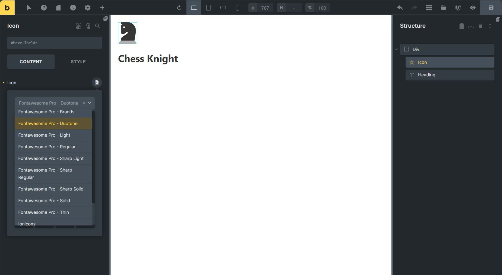
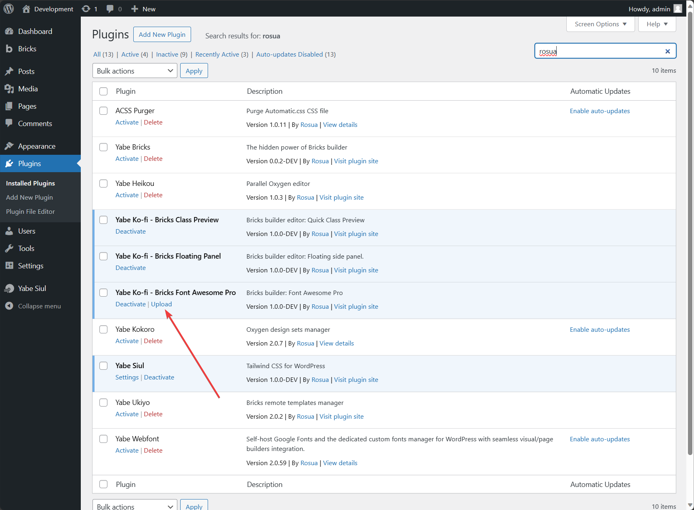
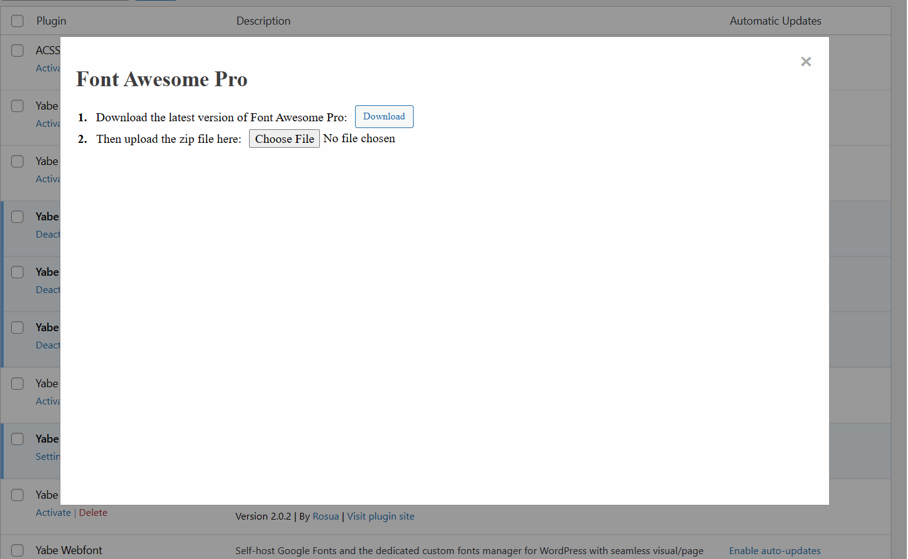

# Yabe Ko-fi - Bricks Font Awesome Pro

    <a aria-label="GitHub release (latest by date including pre-releases)" href="https://github.com/yabe-ko-fi/bricks-fontawesome-pro/releases">
        <picture>
            
        </picture>
    </a>
    <a aria-label="GitHub Sponsors" href="https://github.com/sponsors/suabahasa">
        <picture>
            
        </picture>
    </a>
    <a aria-label="Support me on Ko-fi" href="https://ko-fi.com/Q5Q75XSF7">
        <picture>
            
        </picture>
    </a>
    <a aria-label="Join Our Facebook community" href="https://www.facebook.com/groups/1142662969627943">
        <picture>
            
        </picture>
    </a>

The Font Awesome 6 Pro integration for Bricks Builder.

## Requirements

- Font Awesome 6 [Pro plan](https://fontawesome.com/plans)
- PHP extension `zip` enabled

## Installation

1. Download the plugin zip file
2. Install the plugin by uploading the zip file
3. Activate the plugin
4. Navigate to `Plugins > Installed Plugins` page, and click the `Upload` action link.

5. Follow the on-screen instructions.

## License

[GPL-3.0](./LICENSE)
